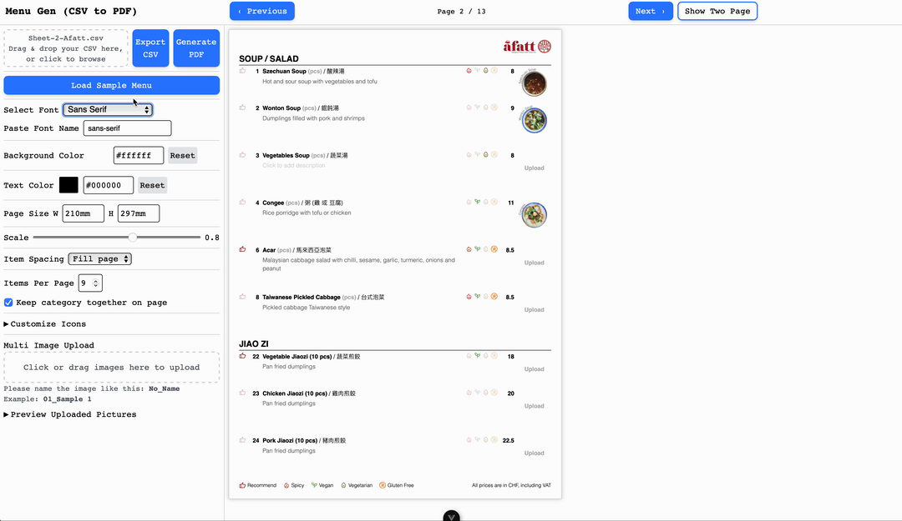
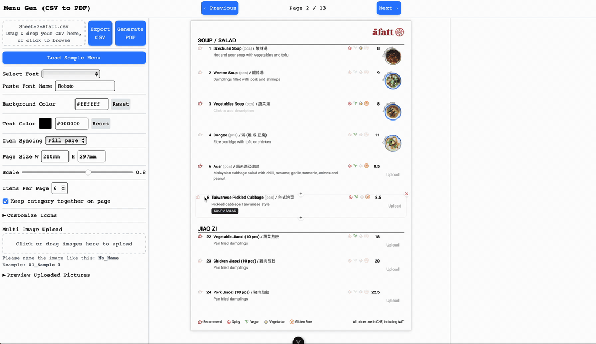
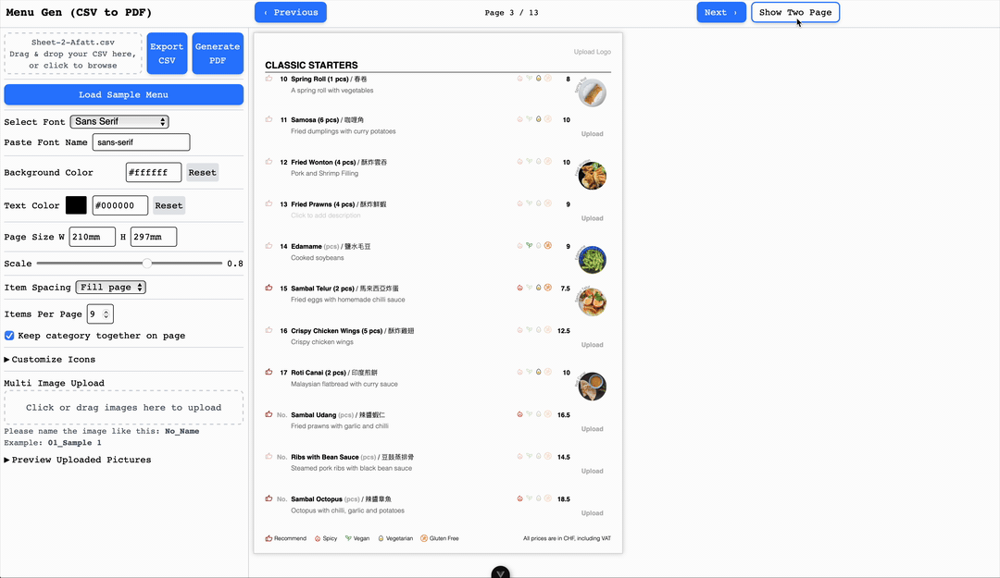

# MenuGen

### CSV → Editable UI → Tailwind Preview → Pixel-Perfect PDF Generator

MenuGen is a smart menu-building tool that transforms a CSV file into an editable Vue interface and generates **pixel-perfect PDFs** using a Node.js backend powered by **Puppeteer**.

It supports:

- CSV Parsing
- Inline Editing (No, Name, ChineseName, Measure, Price, Description, Options, Pictures, Icons, Category)
- Auto category-aware item numbering with intelligent gap reuse
- Logo upload and display in PDF
- Unique item ID tracking (UUID-based, no conflicts)
- Auto Layout (Tailwind CSS v4)
- Support Google Fonts (paste font name to load dynamically)
- Icon & Image Upload with compression
- Preview in Single or Two Page
- Perfect PDF Export (exact same look as the on-screen preview)

---

See the full roadmap in [ROADMAP.md](./ROADMAP.md)

---

# See It In Action

<h3>CSV to PDF</h3>


---

<table>
  <tr>
    <td align="center">
      
      <p>Inline Edit</p>
    </td>
    <td align="center">
      
      <p>Edit Items</p>
    </td>
  </tr>
  <tr>
    <td align="center">
      
      <p>Upload Multi Pictures</p>
    </td>
    <td align="center">
      
      <p>Customize Icons</p>
    </td>
  </tr>
  <tr>
    <td align="center">
      
      <p>View in Single and Two Page</p>
    </td>
  </tr>
</table>

---

# Features

### **Frontend (Vue + Tailwind CSS v4)**

- Upload CSV → auto-structured menu items with auto-generated unique IDs
- Inline editable UI (No, Name, ChineseName, Measure, Price, Description, Categories, Icons)
- Upload custom images or SVG icons per item
- Upload logo image (displays in PDF)
- Drag-and-drop item reordering
- Add/delete items before or after any item
- Smart pagination: keep categories together (11 items per category, 10 when combining)

* Live Tailwind-styled preview
* Sends HTML directly to backend for PDF generation

### **Backend (Node.js + Puppeteer)**

- Wraps incoming HTML with Tailwind CSS
- Inlines & compresses:
  - PNG / JPG images → compressed Base64
  - SVG → converted to PNG (96–200px) or inlined SVG

- Waits for images + fonts to load
- Exports **A4, full-color, print-background PDF**
- Returns PDF inline or downloadable
- Fully CORS enabled

---

# Project Structure

```
menu-gen/
│
├─ frontend/
│  ├─ src/
│  │  ├─ components/
│  │  ├─ views/
│  │  ├─ asset/
│  │  │  ├─ svg/
│  │  │  ├─ pictures/
│  │  │  └─ styles/
│  │  │     └── style.css
│  ├─ public/
│  │  ├── picture/
│  │  ├── data/
│  │  └─ css/
│  │     └─ tailwind.css
│  └─ README.md (Frontend)
│
├─ backend/
│  ├─ server.js
│  ├─ package.json
│  ├─ svg/ (optional shared folder)
│  └─ README.md (Backend)
│
└─ README.md  ← (This combined documentation)
```

---

# Installation & Setup

## **1. Clone Repo**

```bash
git clone https://github.com/yingshiuan/menuGen.git
cd menu-gen
```

---

## **2. Install Frontend**

```bash
cd frontend
npm install
```

### Build Tailwind CSS v4:

**Whenever new TailwindCSS classes are added to the layout, you need to rebuild the CSS.**

```bash
npx @tailwindcss/cli \
  -i ./src/asset/styles/style.css \
  -o ./public/css/tailwind.css \
  --minify
```

---

## **3. Install Backend**

```bash
cd ../backend
npm install
```

Includes:

- express
- puppeteer
- jsdom
- sharp
- cors

---

# Running the App

## **Frontend (Local)**

```bash
cd frontend
npm run dev
```

Default:
👉 [http://localhost:5173/](http://localhost:5173/)

## **Backend (Local)**

```bash
cd backend
node server.js
```

Default:
👉 [http://localhost:3000/](http://localhost:3000/)

## **Docker**

See [Docker.md](./Docker.md) for full instructions on running with Docker Compose.

**Quick start (production — uses `docker-compose.yml`):**

```bash
docker compose up --build backend frontend
```

**Quick start (development with live reload — uses `docker-compose.dev.yml`):**

```bash
docker compose -f docker-compose.dev.yml up --build backend-dev frontend-dev
```

Alternatively, if you prefer a single file with profiles, the repo also supports tagging dev services with a `dev` profile (ask me to switch to profiles if you'd like that).

---

# Workflow

## **1. Upload CSV**

User uploads a CSV file like:

```
No,Price,Name,ChineseName,Description,Recommend,Spicy,Vegan,Vegetarian,Gluten Free
1,12.99,Pizza,披薩,Cheese and tomato sauce,true,false,false,false,true
```

Frontend parses → structured menu → editable state.

---

## **2. User Edits Inline**

- Edit all fields: No, Name, ChineseName, Measure, Price, Description, Category
- Change text color and font (support Google Fonts (paste font name to load dynamically))
- Add images/icons per item
- Upload logo image
- Reorder items via drag-and-drop
- Add/delete items before or after any item
- Live Tailwind preview
- Auto category-aware item numbering (fills gaps, respects per-category ranges)
- Keep categories together on pages (up to 11 items per category, 10 when combining multiple categories)

---

## **3. Export to PDF**

Frontend sends:

```json
{
  "html": "<div>...full menu HTML...</div>"
}
```

to:

```
POST http://localhost:3000/generate-pdf
```

---

# PDF Export Pipeline (Backend)

See [backend/README.md](./backend/README.md) for full backend architecture and image inlining details.

---

### Backend server flow:

#### **1. Parse incoming HTML**

```js
const dom = new JSDOM(html)
const document = dom.window.document
```

#### **2. Detect all `` elements**

Handles:

- `/src/assets/...`
- `public/...`
- ``
- SVG icons

#### **3. Compress everything**

| Type                | How it's processed                    |
| ------------------- | ------------------------------------- |
| Logo (PNG/JPG)      | compress → resize to 32x32px → Base64 |
| Menu Item (PNG/JPG) | compress → resize to 80x80px → Base64 |
| Large SVG           | rasterize using Sharp → PNG → Base64  |
| Small SVG           | inline SVG text → Base64              |

#### **4. Puppeteer loads optimized HTML**

```js
await page.setContent(optimizedHtml, { waitUntil: 'networkidle0' })
```

#### **5. Ensure all images and fonts load**

```js
await page.evaluate(() => document.fonts.ready)
```

#### **6. Generate PDF**

```js
const pdf = await page.pdf({
  format: 'A4',
  printBackground: true,
})
```

#### **7. Send PDF back**

```js
res.set({
  'Content-Type': 'application/pdf',
  'Content-Disposition': "inline; filename='menu.pdf'",
})
```

---

# Image & SVG Handling

## **Image compression (PNG/JPG)**

- If user uploads a 5MB PNG → backend compresses automatically
- Target size: 96–200px (configurable)
- Converted to Base64 for Puppeteer rendering

## **SVG handling**

Backend uses 2 strategies:

### 1. For simple SVG (< 50 KB)

Inline SVG directly:

```
data:image/svg+xml;base64,PHN2Z...
```

### 2. For complex or large SVG (> 50 KB)

Rasterize to PNG via Sharp:

```js
const optimizedBuffer = await sharp(buffer)
  .resize(96, 96, { fit: 'contain' })
  .png({ quality: 100 })
  .toBuffer()
```

This ensures:

- No missing SVG in PDF
- Perfect rendering
- Shrinks file size massively

---

# API Endpoints

### `POST /generate-pdf`

| Field | Type   | Description                        |
| ----- | ------ | ---------------------------------- |
| html  | string | full HTML string exported from Vue |

### Example:

```ts
await fetch('http://localhost:3000/generate-pdf', {
  method: 'POST',
  headers: { 'Content-Type': 'application/json' },
  body: JSON.stringify({ html }),
})
```

---

# Troubleshooting

### **PDF missing images**

Make sure your image paths use:

```
/src/asset/...
```

or convert them to Base64 before sending.

### **Tailwind styles missing**

Rebuild Tailwind CSS:

```bash
npx @tailwindcss/cli ...
```

### **SVG not rendering**

Ensure icon name matches file in `public/svg/`.

---

# License

This project is licensed under the MIT License.

---

## Author

Created by [Ying-Shiuan Chen](https://github.com/yingshiuan/)
