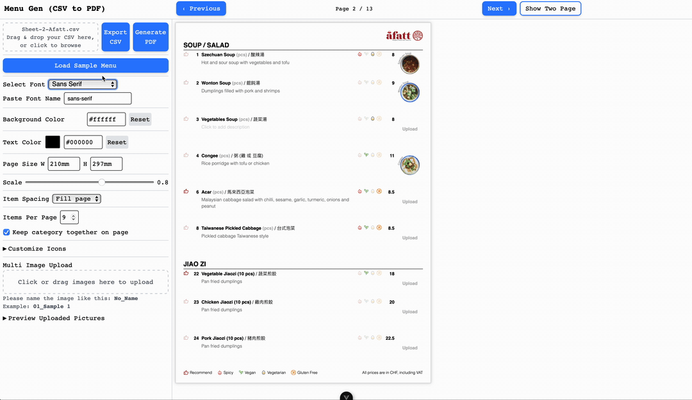
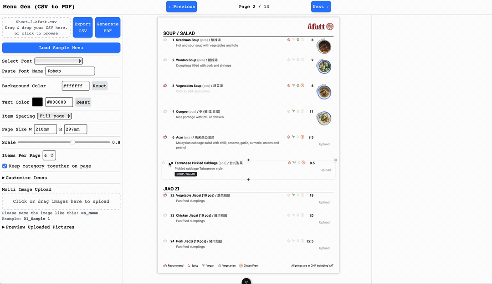
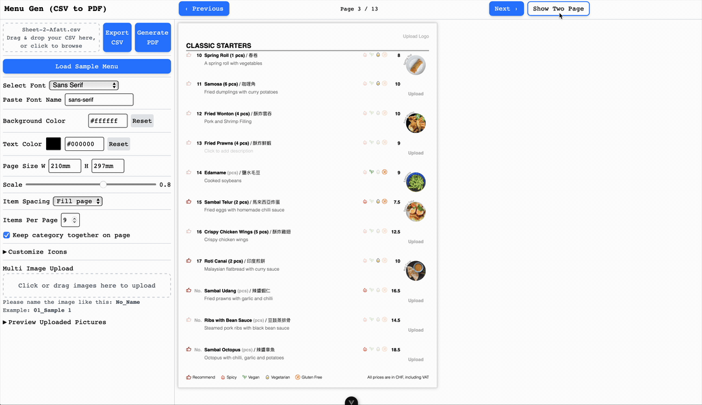

# MenuGen

### CSV → Editable UI → Live Preview → Print-Ready PDF

MenuGen helps restaurants create and maintain professional menus without requiring design or technical skills. It converts CSV data into an intuitive editing interface and generates professionally formatted PDFs automatically.

Visit [MenuGen](https://menugen.insdash.ch/) to try it out.

## Why MenuGen?

Updating restaurant menus is often repetitive and time-consuming, especially when changes need to be reflected across different formats. MenuGen streamlines the workflow by allowing staff to manage menu content from structured data and export ready-to-print menus in seconds.

## Technologies

### Frontend

- **Vue 3** + TypeScript
- **Vite** for build tooling
- **Tailwind CSS v4** for responsive layouts
- **Pinia** for state management
- **PapaParse** for CSV parsing
- **Vitest** for unit testing

### Backend

- **Node.js** + Express server
- **Puppeteer** for HTML-to-PDF rendering
- **Sharp** for image compression
- **JSDOM** for HTML processing
- Async job queue for PDF generation
- Tuned to run within a 512MB / 0.1 CPU instance — see
  [Resource Budget](./backend/README.md#resource-budget-512mb--01-cpu)

## Core Capabilities

### Content

- CSV import with full inline editing (No, Name and Description in English / German / Chinese, Measure, Price, Dietary icons, Pictures, Category)
- Auto-numbering per category with intelligent gap reuse
- Unique UUID-based item tracking

### Media

- Image upload with compression for pictures, icons, and logo
- Image cropper for pictures, icons, and logo
- Google Icons support — paste any icon name to load instantly
- Per-icon color customization

### Typography

- Google Fonts support — paste any font name to load dynamically

### Layout & Export

- Auto Layout (Tailwind CSS v4)
- Single or two-page preview
- Fully responsive — Desktop, Tablet, and Mobile
- Pixel-perfect PDF export identical to the on-screen preview

### Engineering Highlights

- Pixel-perfect HTML-to-PDF rendering with Puppeteer
- End-to-end asset pipeline: upload → crop → compress → inline → render
- SVG optimization strategy (inline vs rasterized)
- Category-aware pagination algorithm

## Rendering Pipeline

MenuGen implements a deterministic HTML-to-PDF rendering pipeline:

User HTML
↓
Asset scanning
↓
Image optimization (Sharp)
↓
SVG handling (inline or rasterized)
↓
Base64 inlining
↓
Puppeteer rendering
↓
PDF Queue
↓
Pixel-perfect PDF output

This pipeline ensures:

- No missing images in the final PDF
- Consistent SVG rendering
- Optimized asset sizes
- Reliable, reproducible output

---

See the full roadmap in [ROADMAP.md](./ROADMAP.md)

---

# Interactive Demo - See It In Action

Visit [MenuGen](https://menugen.insdash.ch/) to try it out.

<h3>CSV to PDF</h3>


---

<table>
  <tr>
    <td align="center">
      
      <p>Inline Edit</p>
    </td>
    <td align="center">
      
      <p>Edit Items</p>
    </td>
  </tr>
  <tr>
    <td align="center">
      
      <p>Upload Multi Pictures</p>
    </td>
    <td align="center">
      
      <p>Customize Icons</p>
    </td>
  </tr>
  <tr>
    <td align="center">
      
      <p>View in Single and Two Page</p>
    </td>
  </tr>
</table>

---

# Features

### **Frontend (Vue + Tailwind CSS v4)**

- Upload CSV → auto-structured menu items with auto-generated unique IDs
- Inline editable UI (No, Name, Measure, Price, Description, Categories, Icons), per menu language
- Upload custom images or SVG icons per item
- Upload logo image (displays in PDF)
- Reusable `ImageUploader` component supports variants (logo, cover, avatar) and powers AddLogo/CoverLogo wrappers
- Drag-and-drop item reordering
- Add/delete items before or after any item
- Smart pagination: keep categories together (11 items per category, 10 when combining)

* Live Tailwind-styled preview
* Sends HTML directly to backend for PDF generation

### **Backend (Node.js + Puppeteer + Async PDF Queue)**

- Wraps incoming HTML with Tailwind CSS
- Inlines & compresses:
  - PNG / JPG images → compressed Base64
  - SVG → converted to PNG (96–200px) or inlined SVG

- Waits for images + fonts to load
- Exports **A4, full-color, print-background PDF**
- Returns PDF inline or downloadable
- Fully CORS enabled

- Wraps incoming HTML with Tailwind CSS
- Inlines & compresses images before rendering:
- PNG / JPG → resized and converted to Base64
- SVG → either inlined or rasterized to PNG (96–200px)
- Waits for all images and fonts to fully load before rendering
- Enqueues PDF generation jobs to avoid Puppeteer overload
- Each request returns a jobId immediately
- Clients can poll /job/:id to check status (queued, processing, done, error)
- Once complete, the PDF is returned:
- Desktop: inline or downloadable via blob
- iOS/iPad: safe preview using blob in hidden <iframe>
- Fully CORS enabled for frontend communication

---

# Project Structure

```
menu-gen/
│
├─ frontend/
│  ├─ src/
│  │  ├─ components/
│  │  │  ├─ controls/
│  │  │  ├─ layouts/
│  │  │  └─ archive/
│  │  ├─ composables/
│  │  ├─ stores/
│  │  ├─ types/
│  │  ├─ router/
│  │  ├─ views/
│  │  ├─ asset/
│  │  │  ├─ png/
│  │  │  ├─ styles/
│  │  │  │   └── style.css
│  │  │  └─ svg/
│  │  └─ __tests__/
│  ├─ public/
│  │  ├─ css/
│  │  │   └─ tailwind.css
│  │  ├─ data/
│  │  ├─ demo/
│  │  └─ picture/
│  ├─ package.json
│  └─ README.md
│
├─ backend/
│  ├─ app/
│  │   └─ pdfApp.js
│  ├─ infrastructure/
│  │   ├─ imageInfra.js
│  │   ├─ pdfQueue.js
│  │   └─ puppeteerInfra.js
│  ├─ routes/
│  │   ├─ pdfRoute.js
│  │   └─ uploadRoute.js
│  ├─ services/
│  │   └─ htmlService.js
│  ├─ server.js
│  ├─ package.json
│  └─ README.md
│
├─ docker-compose.yml
├─ docker-compose.dev.yml
├─ Docker.md
├─ ROADMAP.md
└─ README.md
```

---

# Installation & Setup

## **1. Clone Repo**

```bash
git clone https://github.com/yingshiuan/menuGen.git
cd menu-gen
```

---

## **2. Install Frontend**

```bash
cd frontend
npm install
```

### Build Tailwind CSS v4:

**Whenever new TailwindCSS classes are added to the layout, you need to rebuild the CSS.**

```bash
npx @tailwindcss/cli \
  -i ./src/asset/styles/style.css \
  -o ./public/css/tailwind.css \
  --minify
```

---

## **3. Install Backend**

```bash
cd ../backend
npm install
```

Includes:

- express
- puppeteer
- jsdom
- sharp
- cors

---

# Running the App

## **Frontend (Local)**

```bash
cd frontend
npm run dev
```

Default:
👉 [http://localhost:5173/](http://localhost:5173/)

## **Backend (Local)**

```bash
cd backend
npm start
```

`npm start` applies the Node heap cap that keeps the server inside a 512MB
instance; `node server.js` skips it.

Default:
👉 [http://localhost:3000/](http://localhost:3000/)

## **Docker**

See [Docker.md](./Docker.md) for full instructions on running with Docker Compose.

**Quick start (production — uses `docker-compose.yml`):**

```bash
docker compose up --build backend frontend
```

**Quick start (development with live reload — uses `docker-compose.dev.yml`):**

```bash
docker compose -f docker-compose.dev.yml up --build backend-dev frontend-dev
```

Alternatively, if you prefer a single file with profiles, the repo also supports tagging dev services with a `dev` profile (ask me to switch to profiles if you'd like that).

---

# Workflow

## **1. Upload CSV**

User uploads a CSV file like:

```
No.,Price,Measure,Name (EN),Name (DE),Name (ZH),Description (EN),Description (DE),Description (ZH),Recommend,Spicy,Vegan,Vegetarian,Gluten Free
,,,SOUP / SALAD,SUPPE / SALAT,,,,,,,,,
1,8.5,,Szechuan Soup,Szechuan Suppe,酸辣湯,Hot and sour soup with vegetables and tofu,Scharf-saure Suppe mit Gemüse & Tofu,,,X,,X,
```

- A row with no `No.` and no `Price` is a category row; its name columns name the category for the rows below.
- A flag cell counts as set unless it is empty or `false` / `no` / `nein` / `0` / `-`, so `X`, `true` and the sheet codes `V` `S` `VG` `VT` `G` all work.
- Any other column becomes a custom icon, set per dish by its cell.
- Older sheets still import: plain `Name` / `Description` are read as English, or as German when the headers are German (`Preis`, `Empfohlen`, `Scharf`, `Vegetarisch`, `Glutenfrei`), and `Chinese Name` fills `Name (ZH)`.

Frontend parses → structured menu → editable state. Each dish holds its text per language and its flags as `dietary: { recommend, spicy, vegan, vegetarian, gluten_free }`; the menu is printed in the main language picked under **Language**, and each language ticked under **Also show** (中文 by default) adds that name after a slash: `Szechuan Suppe / Szechuan Soup / 酸辣湯`. Descriptions, categories and icon labels stay in the main language.

---

## **2. User Edits Inline**

- Edit all fields: No, Name (per language), Measure, Price, Description, Category
- Change text color and font (support Google Fonts (paste font name to load dynamically))
- Add images/icons per item
- Upload logo image
- Reorder items via drag-and-drop
- Add/delete items before or after any item
- Live Tailwind preview
- Auto category-aware item numbering (fills gaps, respects per-category ranges)
- Keep categories together on pages (up to 11 items per category, 10 when combining multiple categories)

---

## **3. Export to PDF**

Frontend sends:

```json
{
  "html": "<div>...full menu HTML...</div>"
}
```

to:

```
POST http://localhost:3000/generate-pdf
```

---

# PDF Export Pipeline (Backend)

See [backend/README.md](./backend/README.md) for full backend architecture and image inlining details.

---

### Backend server flow:

#### **1. Shrink inline photos, then parse**

Resizing happens on the raw string, before any DOM exists. JSDOM costs roughly
30x the size of what it parses, so parsing full-resolution photos first is what
used to exhaust a 512MB instance — 11.4MB of HTML needed 344MB of DOM to produce
0.5MB of output.

```js
const shrunkHtml = await shrinkInlineImages(html) // photos → 300px, still a string
const dom = new JSDOM(shrunkHtml) // now cheap to parse
const document = dom.window.document
```

#### **2. Detect all `` elements**

Handles:

- `/src/assets/...`
- `public/...`
- ``
- SVG icons

#### **3. Compress everything**

| Type                | How it's processed                    |
| ------------------- | ------------------------------------- |
| Logo (PNG/JPG)      | compress → resize to 32x32px → Base64 |
| Menu Item (PNG/JPG) | compress → resize to 80x80px → Base64 |
| Large SVG           | rasterize using Sharp → PNG → Base64  |
| Small SVG           | inline SVG text → Base64              |

#### **4. Puppeteer loads optimized HTML**

`waitUntil: 'load'` — it waits for the Google Fonts stylesheet, which
`'domcontentloaded'` does not. `'networkidle0'` waits for total network silence
and, pointed at a CDN, is what produced 60-second timeouts on a cold instance.

```js
try {
  await page.setContent(optimizedHtml, { waitUntil: 'load', timeout: 20000 })
} catch (err) {
  if (err.name !== 'TimeoutError') throw err
  // markup is already in place — export in the fallback face rather than fail
}
```

#### **5. Ensure all images and fonts load**

```js
await page.evaluate(() => document.fonts.ready) // capped, fonts never block the export
```

#### **6. Generate PDF**

```js
const pdf = await page.pdf({
  format: 'A4',
  printBackground: true,
})
```

#### **7. Send PDF back**

```js
res.set({
  'Content-Type': 'application/pdf',
  'Content-Disposition': "inline; filename='menu.pdf'",
})
```

---

# Image & SVG Handling

## **Image compression (PNG/JPG)**

- If user uploads a 5MB PNG → backend compresses automatically
- Target size: 96–200px (configurable)
- Converted to Base64 for Puppeteer rendering

## **SVG handling**

Backend uses 2 strategies:

### 1. For simple SVG (< 50 KB)

Inline SVG directly:

```
data:image/svg+xml;base64,PHN2Z...
```

### 2. For complex or large SVG (> 50 KB)

Rasterize to PNG via Sharp:

```js
const optimizedBuffer = await sharp(buffer)
  .resize(96, 96, { fit: 'contain' })
  .png({ quality: 100 })
  .toBuffer()
```

This ensures:

- No missing SVG in PDF
- Perfect rendering
- Shrinks file size massively

---

# API Endpoints

### `POST /generate-pdf`

| Field | Type   | Description                        |
| ----- | ------ | ---------------------------------- |
| html  | string | full HTML string exported from Vue |

### Example:

```ts
await fetch('http://localhost:3000/generate-pdf', {
  method: 'POST',
  headers: { 'Content-Type': 'application/json' },
  body: JSON.stringify({ html }),
})
```

---

# Troubleshooting

### **PDF missing images**

Make sure your image paths use:

```
/src/asset/...
```

or convert them to Base64 before sending.

### **Tailwind styles missing**

Rebuild Tailwind CSS:

```bash
npx @tailwindcss/cli ...
```

### **SVG not rendering**

Ensure icon name matches file in `public/svg/`.

### **PDF uses the wrong font**

The browser preview and the PDF load fonts by different routes: the preview
appends a `<link>` to the live document, the export fetches it inside Puppeteer.
If the render does not wait for that stylesheet the PDF falls back silently, so
the preview looks right and the PDF does not. The export waits for
`waitUntil: 'load'`; a `Stylesheets did not load in time` line in the backend log
means the webfont missed its budget and the menu was exported in the fallback
face.

### **Export fails on a free-tier host**

Three different failures, told apart by the log:

- `JavaScript heap out of memory` with a native stack — Node held too much at
  once. Almost always something large being parsed rather than streamed.
- The process dies with no JS error — the container's OOM killer. Total RSS
  including Chromium exceeded the instance.
- `Navigation timeout of 60000 ms exceeded` — a wait that never completed,
  usually on an external resource.

The first export after ~15 minutes of inactivity also pays a ~50s cold start
while the instance wakes. See
[backend/README.md → Resource Budget](./backend/README.md#resource-budget-512mb--01-cpu)
for the measurements, every tunable limit, and why each is set where it is.

---

# License

This project is licensed under the MIT License.

---

## Author

Created by [Ying-Shiuan Chen](https://github.com/yingshiuan/)
